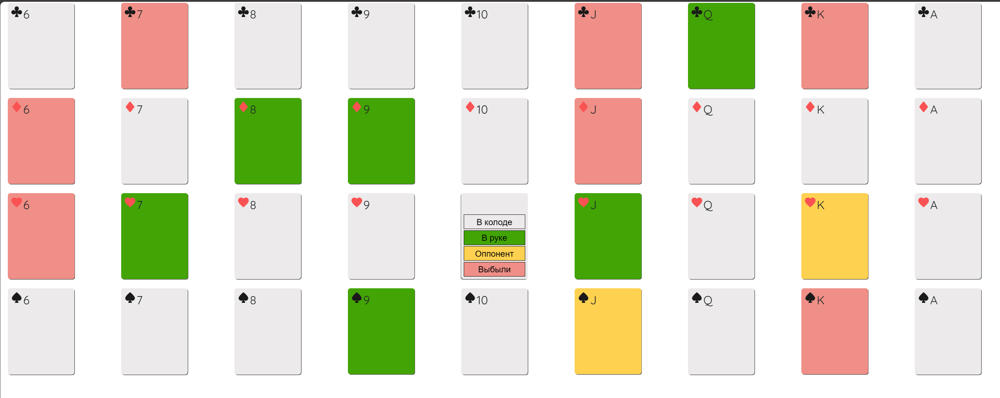
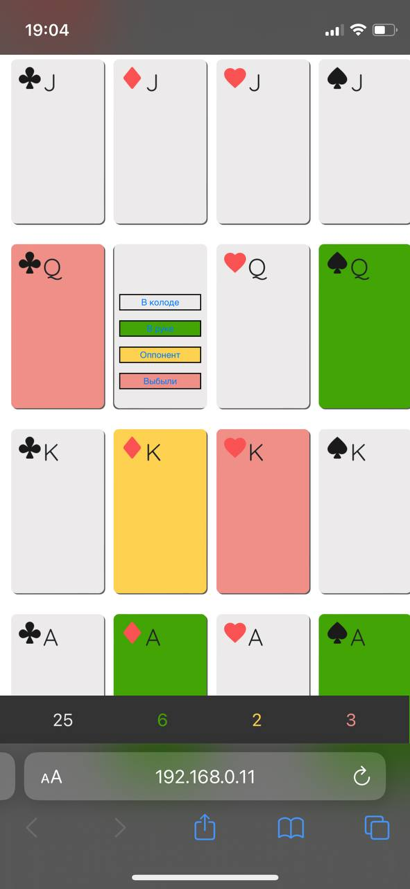
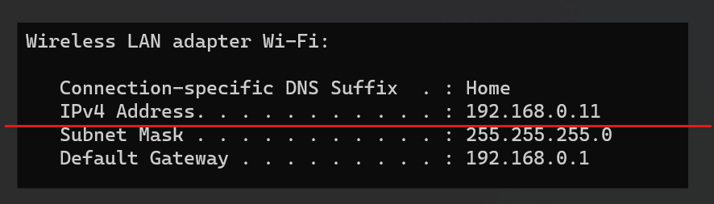

# Учет карт в карточной игре "Дурак"
**Карты подлежащие учету**:
- В руке
- У оппонента
- В колоде
- Выбывшие

## Интерфейс
**ПК и планшеты**  

> При использовании ПК и планшетов карты упорядочиваются по масти и выстраиваются в 4 строки по 9 карт в каждой

**Телефон**  

> При использовании Телефона карты упорядочиваются по номиналу и выстраиваются в 9 строк по 4 карты в каждой

## Управление
- Нажать на карту
- На обратной стороне карты нажать на нужную кнопку
  - В колоде
  - В руке
  - Оппонент
  - Выбыли
- После нажатия карта перевернется рубашкой вниз и примет цвет согласно статусу
  - Белый - В колоде
  - Зеленый - В руке
  - Желтый - У оппонента
  - Красный - Выбыла
- Счетчик карты обновится

## Установка и запуск
**Зависимости**:
- Python 3.10+

**Команды**:
- pip install -r requirements.txt
- uvicorn main:app --host 0.0.0.0 --port 80
- ifconfig или ipconfig

- В адресной строке браузера перейти по IPv4 адресу из предыдущего шага
- Можно пользоваться в пределах одного wi-fi неограниченному количеству человек